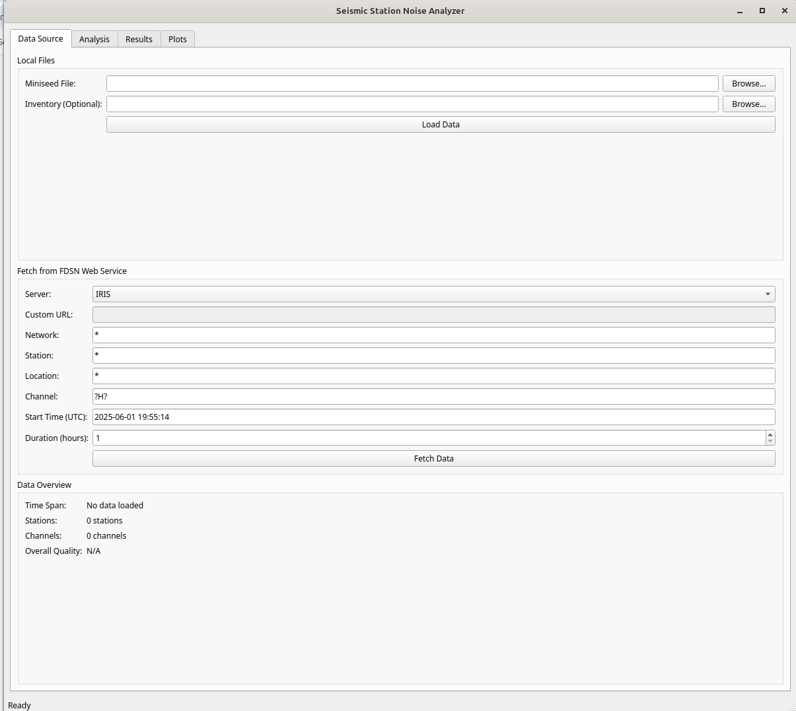

# Seismic Station Noise Analyzer

[](https://www.python.org/downloads/)
[](https://opensource.org/licenses/MIT)
[](https://obspy.org/)

A comprehensive GUI application for analyzing seismic station noise levels and evaluating station suitability for local earthquake detection. This tool processes seismic data from both local files and FDSN web services, calculates power spectral density (PSD), compares noise levels against Peterson's New Low/High Noise Models (NLNM/NHNM), and generates detailed interactive reports.



## Features

### 🔍 **Data Input & Processing**
- Load MiniSEED files with optional StationXML inventory
- Fetch data directly from FDSN web services (IRIS, AUSPASS, RASPISHAKE, GEOFON, etc.)
- Automatic data quality assessment and gap detection
- Event detection and removal using STA/LTA algorithms

### 📊 **Advanced Analysis**
- Power Spectral Density (PSD) calculation with robust statistical methods
- Multiple analysis approaches:
  - **Absolute Threshold**: Fixed dB threshold above NLNM
  - **Relative Ranking**: Select top percentage of quietest stations
  - **Statistical Method**: Stations within N standard deviations of the best
- Frequency-dependent weighting for target signal optimization
- Compliance checking against Peterson's noise models

### 📈 **Visualization & Reporting**
- Interactive PSD plots with confidence intervals
- Comparison with NLNM/NHNM boundaries
- Color-coded suitability assessment
- Comprehensive HTML reports with embedded plots
- Sortable and filterable results tables

### ⚙️ **Customization**
- Configurable frequency ranges with presets (Teleseismic, Regional, Local)
- Adjustable PSD parameters (segment length, overlap, windowing)
- Save/load analysis settings
- Multiple export formats (CSV, HTML, PNG)

## Installation

### Prerequisites
- Python 3.7 or higher
- PyQt5 for GUI components

### Dependencies
```bash
pip install obspy numpy pandas scipy matplotlib PyQt5
```

### Quick Install
```bash
# Clone the repository
git clone https://github.com/comoglu/seismic-station-analyzer.git
cd seismic-station-analyzer

# Install dependencies
pip install -r requirements.txt

# Run the application
python seismic-station-analyzer.py
```

## Usage

### 1. Starting the Application
```bash
python seismic-station-analyzer.py
```

### 2. Loading Data

#### Option A: Local Files
1. Go to the **Data Source** tab
2. Browse for your MiniSEED file
3. Optionally add StationXML inventory for response removal
4. Click **Load Data**

#### Option B: FDSN Web Services
1. Select an FDSN server (IRIS, GEOFON, etc.)
2. Enter network, station, location, and channel codes
3. Set start time and duration
4. Click **Fetch Data**

### 3. Configuring Analysis
1. Switch to the **Analysis** tab
2. Set frequency range or choose a preset:
   - **Teleseismic**: 0.7-2 Hz
   - **Regional**: 1-10 Hz  
   - **Local**: 1-8 Hz
3. Choose analysis method and threshold
4. Configure PSD parameters if needed
5. Click **Run Analysis**

### 4. Viewing Results
- **Results tab**: Sortable table with station rankings
- **Plots tab**: Individual station PSD plots
- Export comprehensive HTML report with interactive features

## Analysis Methods

### Absolute Threshold
Sets a fixed threshold (in dB) above the NLNM. Stations with noise levels below this threshold are considered suitable.

**Use case**: When you have specific noise requirements for your application.

### Relative Ranking
Ranks all stations and selects the top N% quietest stations, regardless of absolute noise levels.

**Use case**: When you need a specific number of stations and want the best available options.

### Statistical Method
Identifies stations within a certain number of standard deviations from the quietest station.

**Use case**: When you want stations statistically similar to your best performing station.

## Example Workflows

### Local Earthquake Network Assessment
```python
# Recommended settings for local earthquake detection
Frequency Range: 1-8 Hz (Local preset)
Analysis Method: Absolute Threshold
Threshold: 60 dB above NLNM
Event Detection: Enabled
```

### Regional Seismic Monitoring
```python
# Recommended settings for regional events
Frequency Range: 1-10 Hz (Regional preset)
Analysis Method: Relative Ranking
Select Top: 30% of stations
Frequency Weighting: Enabled (peak at 5 Hz)
```

## Output Files

The application generates several output files in your specified directory:

- `noise_results.csv`: Detailed results for all stations/channels
- `noise_report.html`: Interactive report with embedded plots
- `{station}_noise_psd.png`: Individual PSD plots for each station
- `settings/{name}.json`: Saved analysis configurations

## Understanding the Results

### Compliance Metrics
- **Full spectrum**: Percentage of data within noise models across all frequencies
- **Range of interest**: Compliance within your selected frequency range
- **Segmented analysis**: Weighted compliance across logarithmic frequency segments

### Quality Ratings
- **Good**: >90% compliance, suitable for high-quality recordings
- **Fair**: 70-90% compliance, acceptable for most applications  
- **Poor**: <70% compliance, may have significant noise issues

## Troubleshooting

### Common Issues

**"No data loaded" error**
- Check file paths and permissions
- Verify MiniSEED file format
- Ensure network connectivity for FDSN services

**"Segment length too short" warning**
- Increase segment length in PSD parameters
- Use longer duration data
- Reduce minimum frequency if analyzing low frequencies

**Poor PSD quality**
- Check for data gaps or instrumental problems
- Enable event detection to remove earthquakes
- Verify instrument response removal

### Performance Tips
- Use shorter data segments for faster processing
- Enable event detection for cleaner noise analysis
- Save analysis settings for repeated workflows

## Contributing

Contributions are welcome! Please feel free to submit a Pull Request. For major changes, please open an issue first to discuss what you would like to change.

### Development Setup
```bash
git clone https://github.com/comoglu/seismic-station-analyzer.git
cd seismic-station-analyzer
pip install -e .
```

## Citation

If you use this software in your research, please cite:

```bibtex
@software{comoglu2025seismic,
  author = {Comoglu, Mustafa},
  title = {Seismic Station Noise Analyzer: A tool for evaluating station suitability for local earthquake detection},
  url = {https://github.com/comoglu/seismic-station-analyzer},
  year = {2025}
}
```

## License

This project is licensed under the MIT License - see the [LICENSE](LICENSE) file for details.

## Acknowledgments

- [ObsPy](https://obspy.org/) for seismic data processing capabilities
- Peterson, J. (1993) for the New Low and High Noise Models
- The seismological community for FDSN web services

## Contact

**Mustafa Comoglu**
- Email: comoglu@gmail.com
- GitHub: [@comoglu](https://github.com/comoglu)

---

⭐ **If this tool helps your research, please consider giving it a star!**